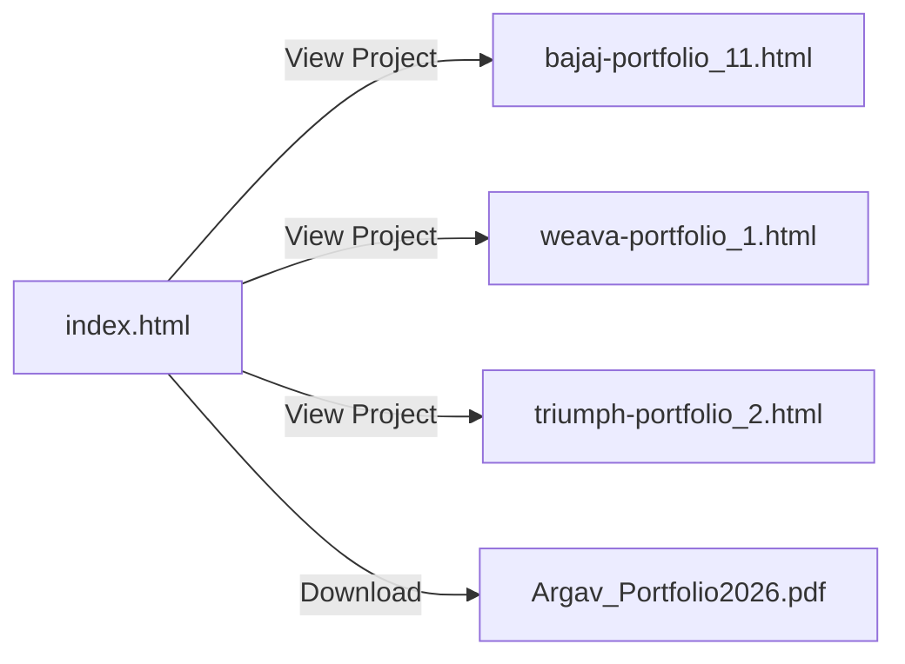
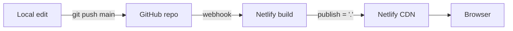

# Portfolio Website — Architecture

Single-designer portfolio for Argav Ganorkar (Industrial Designer). Static, zero-build, multi-page site: one landing page plus three standalone case-study pages, each a fully self-contained HTML document.

## 1. File structure

```
website/
├── index.html                    # Landing page (hero, about, project grid, notebook/footer)
├── triumph-portfolio_2.html      # Case study: Triumph Bobber — CMFG Design
├── weava-portfolio_1.html        # Case study: Weava — Material Exploration
├── bajaj-portfolio_11.html       # Case study: Bajaj Pulsar NS 400 — CMFG Design
├── Argav_Portfolio2026.pdf       # Downloadable résumé/portfolio PDF, linked from index.html
├── netlify.toml                  # Deploy config: publish dir + security headers
├── .gitignore                    # Excludes backups + orphaned source images
│
├── portfolio_31_backup.html      # Local-only snapshot of a prior index.html revision
├── portfolio_31_backup2.html     # Local-only snapshot of a prior index.html revision
├── Gradient.png                  # Orphaned source image (not referenced by any page)
├── Movie.png                     # Orphaned source image
├── City.png                      # Orphaned source image
├── LAB Final.png                 # Orphaned source image
├── NEW FInal.png                 # Orphaned source image
└── only for doodle n image reference in hero.html   # Scratch reference file for hero art, not served
```

The `.gitignore`-excluded files (backups, orphaned PNGs, the scratch reference HTML) exist only on the local disk for authoring convenience; they are never pushed to the repo and never deployed.

## 2. Page architecture

Every HTML page is **self-contained**: inline `<style>` (1 block/page) and inline `<script>` (3–6 blocks/page), with source images embedded as `data:` URIs rather than linked files. The only external network dependency across all pages is **Google Fonts** (`fonts.googleapis.com` / `fonts.gstatic.com`, preconnected). There is no bundler, no `package.json`, no framework runtime, and no CDN script dependency — the hero canvas animation and scroll interactions are hand-written vanilla JS/Canvas (no GSAP/Three.js/Lenis).

This design is intentional for a portfolio: each page is a single artifact that can be opened offline, emailed, or dropped on any static host with zero build step — at the cost of large individual file sizes (3.7–7.8 MB per page) because imagery is base64-inlined instead of fetched as separate assets.

**Exception:** `index.html`'s mobile hero (`<=768px`) uses one real external file, `assets/images/Result.png`, referenced via a `background-image` declared only inside the `@media (max-width:768px)` block — browsers skip fetching a background-image whose media query doesn't match, so desktop visitors never download it, and mobile visitors avoid inflating the base HTML payload with an image only they use. `assets/images/Doodle.png` and `Image.png` are the unused source layers for that composite (kept for future reference, not referenced by any page).

### 2.1 `index.html` (landing page)
Sections (by `id`), in document order:
- `#hero` — full-viewport intro with `#heroCanvas` (interactive canvas doodle: `#heroDoodleBase`, `#heroInteractive`, `#heroPortraitNormal` layers)
- `#about` — bio copy (`#aboutWords`)
- `#projects` — project grid (`#projectsTrack`, `#projectsCursor`), with one `.pcard` per case study:
  - Bajaj Pulsar NS 400 → links to `bajaj-portfolio_11.html`
  - Weava → links to `weava-portfolio_1.html`
  - Triumph Bobber → links to `triumph-portfolio_2.html`
  - (plus an Ola-related card asset, `#imgOla`)
- `#notebook` — scroll-pinned sketchbook/footer module (`#nbPinWrap`, `#nbBoard`, `#nbBoardFixed`, `#nbScrollSpacer`, `#nbTickerTrack`, `#nbFooterBar`) referencing `#nbImgChetak`, `#nbImgCity`, `#nbImgGradient`, `#nbImgLab`, `#nbImgMovie`
- `#nav` — persistent navigation
- Links out to `Argav_Portfolio2026.pdf` as a résumé download

### 2.2 Case-study pages
`triumph-portfolio_2.html`, `weava-portfolio_1.html`, `bajaj-portfolio_11.html` are independent, non-templated documents (each hand-authored, not generated from a shared layout). They are reachable only via the project cards on `index.html` — there is no shared nav component or router; each page is a dead-end leaf linked back to `index.html` manually within its own markup.

## 3. Site map



## 4. Deployment

**Host:** Netlify, deploying from GitHub (`argavganorkar/portfolio`, branch `main`) via continuous deployment — every push to `main` triggers a new production deploy.

**`netlify.toml`:**
```toml
[build]
  publish = "."

[[headers]]
  for = "/*"
  [headers.values]
    X-Frame-Options = "DENY"
    X-Content-Type-Options = "nosniff"
```
- No `[build].command` — there is nothing to compile; Netlify serves the repo root as-is.
- `publish = "."` serves the repository root directly (`index.html` as the implicit site root).
- Security headers applied to every route: clickjacking protection (`X-Frame-Options: DENY`) and MIME-sniffing protection (`X-Content-Type-Options: nosniff`).

**Deploy flow:**


**Routing on Netlify:** default static-file routing — each `.html` file is served at its own path (e.g. `/bajaj-portfolio_11.html`); no redirects/rewrites are configured.

**Repo hygiene:** `.gitignore` keeps backup HTML snapshots and orphaned reference images out of the deployed artifact, so the live site only ships the four HTML pages, the résumé PDF, and `netlify.toml`.

## 5. Constraints and tradeoffs

- **No build pipeline** → zero deploy risk from tooling, but no shared partials: any nav/footer change must be hand-edited in all four HTML files.
- **Base64-embedded images** → pages are portable single files, but page weight (up to 7.8 MB) means first load is heavier than an equivalent asset-split site; no browser image caching across pages since each page's images are unique inline data.
- **No sitemap/robots.txt present** — not configured for search indexing beyond default crawl.
